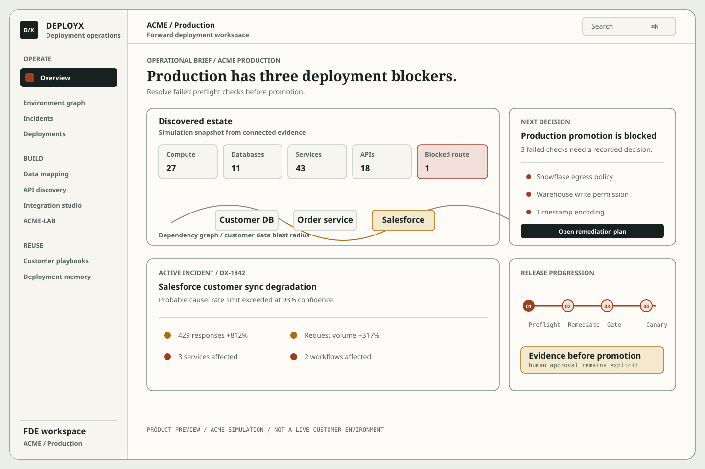
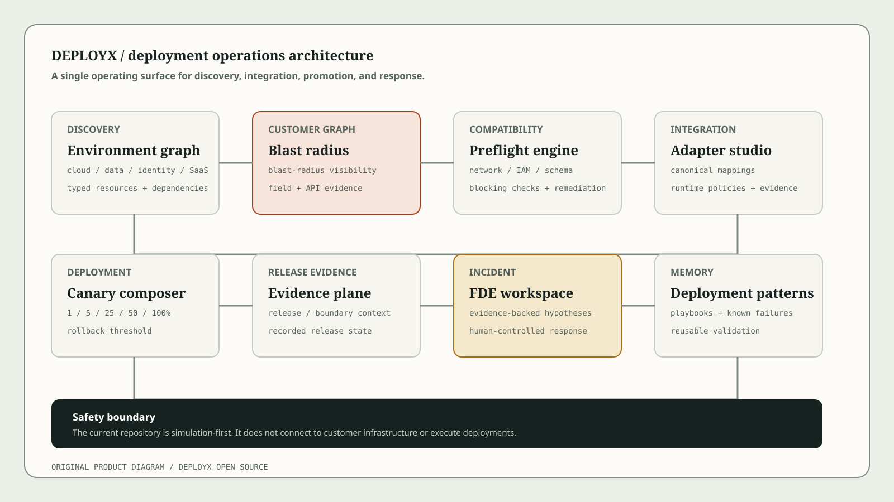
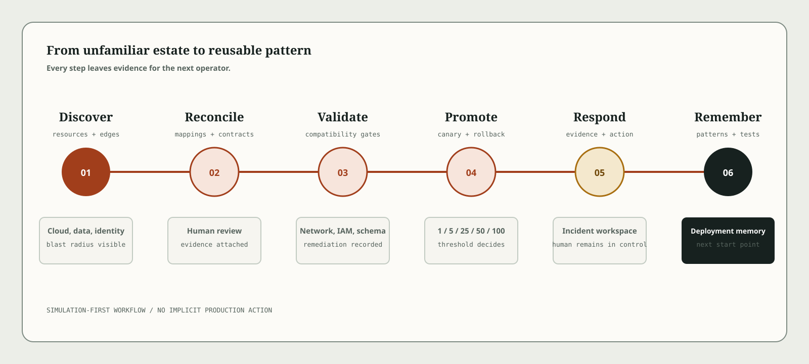

# DEPLOYX

DEPLOYX is a simulation-first deployment and integration operations workspace for heterogeneous enterprise environments. It is designed around the work of a Forward Deployment Engineer: understand an unfamiliar estate, make dependencies visible, reconcile customer data, inspect undocumented interfaces, validate a release, and preserve the decisions that make the next deployment easier.

The repository contains a Next.js operations console, a typed FastAPI control plane, domain engines for graph traversal and compatibility checks, and a reproducible ACME-LAB for failure-mode exploration.

> ACME is a fictional customer used throughout the project. The current implementation uses deterministic local fixtures. It does not connect to customer infrastructure and does not execute deployments.

## Product visuals

The following original vector previews are included for documentation, demos, and marketing. They are product visuals based on the simulation workspace, not screenshots of a live customer environment.







The asset guide, captions, demo script, and social copy live in [docs/marketing/MARKETING.md](docs/marketing/MARKETING.md). When the web app is running, the public marketing page is available at `/marketing`.

## What it demonstrates

- **Environment discovery:** represent cloud accounts, Kubernetes clusters, APIs, databases, identity providers, SaaS systems, and internal services as typed resources.
- **Blast-radius analysis:** traverse dependency and dependent relationships from a resource and identify directly and transitively affected systems.
- **Data mapping review:** compare inconsistent customer identifiers, inspect evidence, and record approve, reject, or reopen decisions.
- **API discovery:** keep observed REST and SOAP contracts, response fields, authentication requirements, and review states in one catalog.
- **Integration workbench:** configure canonical field mappings and runtime policies, then generate local adapter validation evidence.
- **Deployment preflight:** evaluate infrastructure, network, security, and data checks before allowing a canary plan to move forward.
- **Canary rehearsal:** advance through 1%, 5%, 25%, 50%, and 100% simulated traffic, with an explicit error-threshold rollback path.
- **Incident workspace:** correlate simulated deployment, resource, and workflow evidence before recording containment actions.
- **Customer playbooks:** keep customer-specific integration, security, and deployment policy in an editable YAML contract.
- **Deployment memory:** turn repeated failure patterns into reusable requirements, tests, and rollout strategies.
- **ACME-LAB:** run local PostgreSQL, MySQL, Redis, Kafka, mock Salesforce, and mock Okta services with deliberate fault controls.

## Architecture

```text
                         DEPLOYX
                            │
       ┌────────────────────┼────────────────────┐
       │                    │                    │
  Web console       FastAPI control plane     ACME-LAB
       │                    │                    │
       │       graph, data, API, preflight,     │
       │       mapping, canary, incident        │
       │                    │                    │
       └────────────────────┴────────────────────┘
                            │
                   deterministic simulation data
```

The web console is fixture-first so it can be explored without infrastructure credentials. A typed client in `apps/web/lib/control-plane.ts` is ready to connect the views to the FastAPI boundary. The control plane currently stores its ACME records in memory and exposes simulation metadata in its OpenAPI document.

## Repository layout

```text
apps/
├── web/                    Next.js App Router console
│   ├── app/                Operational routes and shared states
│   ├── components/         Field-operations UI and workflows
│   └── lib/                Types, fixtures, navigation, API client
├── control-plane/          FastAPI service and domain logic
│   ├── app/                Models, graph, compatibility, incidents
│   └── tests/              Focused domain tests
infra/
└── acme-lab/               Docker Compose enterprise simulation
.github/
└── workflows/              CI definitions
```

## Getting started

### Web console

Prerequisites:

- Node.js 22
- pnpm 10.12.1

```bash
pnpm install
pnpm dev
```

The console opens at `http://localhost:3000`. The default workspace uses the local ACME production fixture. The environment selector explicitly identifies when a non-production fixture is not populated.

Useful commands:

```bash
pnpm lint
pnpm typecheck
pnpm build
```

Set `NEXT_PUBLIC_SITE_URL` in the deployment environment when the site is hosted somewhere other than localhost. The marketing page uses it to build absolute social preview metadata.

### FastAPI control plane

Prerequisites:

- Python 3.11 or newer

```bash
cd apps/control-plane
python -m venv .venv
source .venv/bin/activate
pip install -e ".[test]"
uvicorn app.main:app --reload --port 8000
```

The API is available under `http://localhost:8000/api/v1`. FastAPI's interactive documentation is available at `/docs` while the service is running.

Key endpoints:

| Method | Endpoint | Purpose |
| --- | --- | --- |
| `GET` | `/api/v1/health` | Read simulation metadata |
| `GET` | `/api/v1/resources` | List typed enterprise resources |
| `POST` | `/api/v1/graph/blast-radius` | Calculate dependency impact |
| `POST` | `/api/v1/compatibility/evaluations` | Evaluate a workload profile |
| `GET` | `/api/v1/mappings` | Review mapping suggestions |
| `POST` | `/api/v1/mappings/{id}/reviews` | Record a mapping decision |
| `POST` | `/api/v1/deployments/preflight` | Build a deployment preflight result |
| `GET` | `/api/v1/incidents` | Read simulated incidents |
| `POST` | `/api/v1/incidents/{id}/correlations` | Correlate supplied incident context |

### ACME-LAB

The lab is optional and uses loopback-bound local services. Review the environment file before starting it.

```bash
cd infra/acme-lab
cp .env.example .env
docker compose up -d
docker compose down
```

The lab includes deliberately inconsistent customer identifiers and local mock services for Salesforce and Okta. It is intended for repeatable demonstrations and local failure-mode work, not for connecting to a real customer account.

## How the workflow fits together

1. Select the simulated ACME environment and inspect the discovered resource graph.
2. Follow a resource to its dependencies, permissions, and affected services.
3. Review customer field suggestions and record a human decision.
4. Configure the canonical adapter and generate local validation evidence.
5. Run deployment preflight, apply only the fixes you can justify, and run preflight again.
6. Open the promotion gate, move through the canary stages, and rehearse rollback at the error threshold.
7. Use the incident workspace to record evidence, acknowledgement, containment, and resolution.
8. Promote recurring customer-specific decisions into playbooks and deployment memory.

The platform keeps the operator in control. Suggestions and evidence do not silently merge data, approve access, or deploy code.

## Project status

This repository is an open-source portfolio implementation and a safe simulation baseline. The following capabilities are intentionally not enabled yet:

- Authentication and tenant authorization
- Durable persistence
- Live cloud, SaaS, or Kubernetes provider adapters
- Production deployment execution
- Production secrets and customer data
- A hosted multi-tenant control plane

Those boundaries are deliberate. They keep the project safe to run locally and make the next engineering steps explicit.

## Contributing

Contributions are welcome. Read [CONTRIBUTING.md](CONTRIBUTING.md) before opening a pull request. Please keep fixtures clearly labeled as simulation data and never include real credentials, customer records, or private endpoints.

## Security

Please read [SECURITY.md](SECURITY.md) before reporting a vulnerability. The current project is a local simulation and should not be treated as a production security boundary.

## License

DEPLOYX is open source under the [MIT License](LICENSE).

Copyright (c) 2026 Sathwik-giddi
